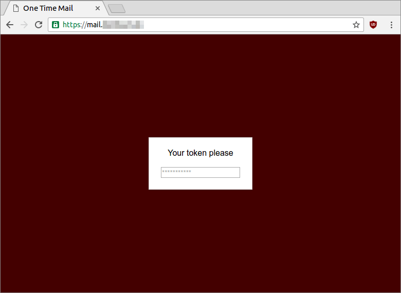
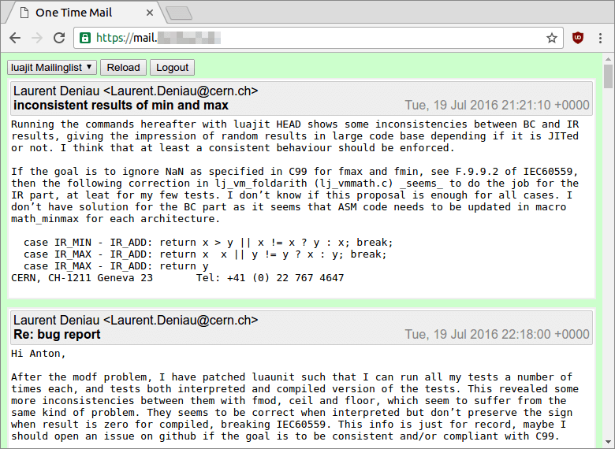

# One Time Mail

A quick way of accessing predefined mailboxes in an IMAP account
with a browser using one time passwords or a yubikey.





## Why? How? What?

I have my emails on [FastMail](https://fastmail.com). They recently
released an [update](https://blog.fastmail.com/2016/07/25/two-step-verification-and-other-new-security-features/)
that made it easier secure your account. It also 
removed some features that I really liked: Access to a limited
version of your mailbox using a YubiKey or One Time Passwords.
It was a good feeling of having a way to get limited access to
your mailbox if you are travelling and don't have a fully trusted
machine with you.

Those features are gone now but I still want to have a way to
quickly check mails without exposing my mailbox on an untrusted
machine. So I build this tools. It provides the following features:

 * One Time Password or YubiKey based authentication.
 * Read-Only access to a configurable set of mailboxes.
 * Authorization is bound to a websocket connection. So
   reloading the page or closing that websocket is equivalent
   to logging out. It also means that there are no cookies
   that could be stolen and reused elsewhere.
 * Session are time limited.

Not available right now:

 * Responding to mails, marking them as read or other
   mailbox mutating operations. Everything is read-only
   at the moment.

Ideas:

 * Add the ability create a regex(?) based blacklist that
   would filter out mails.
 * Add sorting, pagination.
 * Ability to mark mails as read.

# Installation on Ubuntu

```
apt-get install python python-dev python-virtualenv python-lxml libffi-dev libssl-dev
mkdir /mail && cd /mail
virtualenv --system-site-packages env
. env/bin/activate
pip install -r requirements.txt
useradd otm

cp config.json.example config.json
# Edit config.json now (see below)

# You can try otm now by starting
python otm.py

# For automatically starting otm using daemontools:
apt-get install daemontools-run
ln -s /mail /etc/service

# Add proper SSL using nginx now (see below)
```

# Configuration

## Setting up nginx

Make sure to setup a proper secure https server (using
for example with a letsencrypt certificate). You can then
use a configuration similar to this one:

```
# /etc/nginx/sites-enabled/otm.conf
map $http_upgrade $connection_upgrade {
    default upgrade;
    '' close;
}

server {
    listen 80;
    server_name mail.example.org;
    location / {
        rewrite (.*) https://$server_name$1 permanent;
    }

    location /.well-known/acme-challenge/ {
        alias /le/challenges/;
        try_files $uri =404;
    }
}

server {
    listen 443 ssl;
    server_name mail.example.org;

    ssl on;
    ssl_certificate      /le/domain.pem;
    ssl_certificate_key  /le/domain.key;
    ssl_session_cache shared:SSL:10m;
    ssl_session_timeout 10m;
    ssl_protocols TLSv1 TLSv1.1 TLSv1.2;
    ssl_ciphers EECDH+CHACHA20:EECDH+AES128:RSA+AES128:EECDH+AES256:RSA+AES256:EECDH+3DES:RSA+3DES:!MD5;
    ssl_prefer_server_ciphers on;

    add_header Strict-Transport-Security "max-age=31536000";

    location / {
        proxy_http_version 1.1;
        proxy_pass http://127.0.0.1:8080;
        proxy_set_header Upgrade $http_upgrade;
        proxy_set_header Connection $connection_upgrade;
    }
}
```

## Using One Time Passwords

Generate the file `state.otp` by running

```
pwgen -1 10 30 > state.otp
chown otm:otm state.otp
```

You might also use any other password generator as long as
it creates a file with one token per line and each line
contains at least 8 characters.

You can then print out the file `state.otp` and put it in
your wallet.

Finally add this `authenticator` configuration to `config.json`:

```
"authenticator": {
  "name": "otp",
  "args": {
    "state_file": "state.otp"
  }
}
```

If you run out of tokens just repeat the pwgen command.

## Using a YubiKey

Goto https://upgrade.yubico.com/getapikey/ and get an API key.
Then add this `authenticator` configuration to `config.json`:

```
"authenticator": {
  "name": "yubi",
  "args": {
    "client_id": "<CLIENT_ID>",
    "secret_key": "<SECRET_KEY>",
    "yubikey_id": "<FIRST 12 CHARACTERS OF YOUR YUBIKEY OUTPUT>"
  }
}
```
